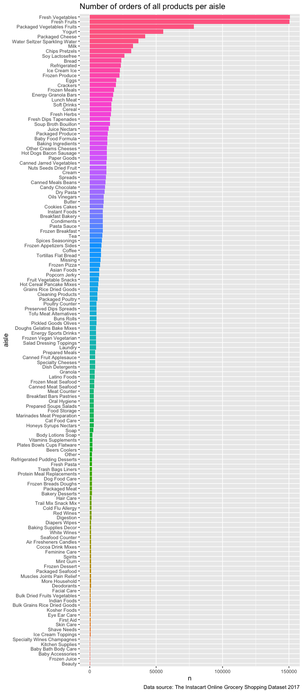
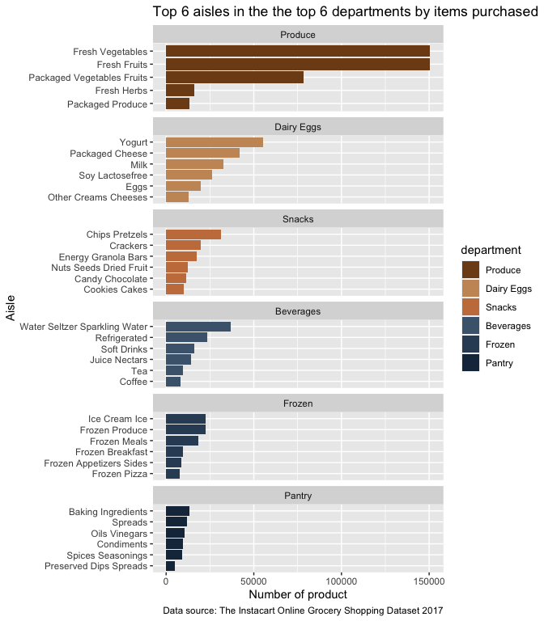

hw3-7462
================
XiaoMa

# 3.1

``` r
instacart <- read.csv("./data/instacart.csv", stringsAsFactors=TRUE)
instacart$department <-as.factor(str_to_title(instacart$department)) #change into title format and then change into factor
instacart$aisle <-as.factor(str_to_title(instacart$aisle)) #change into title format and then change into factor
instacart %>%
  group_by(order_id,user_id) %>%
  summarise(number_of_days_since_last_order=unique(days_since_prior_order),
            number_of_items_purchased=n(),
            number_of_aisles= aisle_id %>% unique() %>% length(),
            number_of_departments= department_id %>% unique() %>% length(),
            order_number=unique(order_number),
            percent_of_items_reordered=mean(reordered)) %>%
  ungroup()%>%
  summarise(across(contains(c("number","percent")),  list(mean = mean, median=median, sd = sd), na.rm=FALSE, .names = "{.col}__{.fn}"))  %>%
  pivot_longer(cols=starts_with(c("number_of_days_since_last_order","number_of_items_purchased","number_of_aisles","number_of_departments","order_number","percent_of_items_reordered")), names_to = "term",values_to = "value") %>%
  separate(col = term,into = c("m","statistic"),sep = "__") %>%
  gt(rowname_col = "statistic", groupname_col = "m")  %>%
  fmt_number(columns = c("value"),decimals = 2) %>%
  cols_align(align = c("center"),columns = everything()) %>%
  tab_header(title = "Summary statistics of 6 variables") %>%
  tab_source_note(source_note = "Data source: The Instacart Online Grocery Shopping Dataset 2017")
```

<div id="zeftjoxczf" style="overflow-x:auto;overflow-y:auto;width:auto;height:auto;">
<style>html {
  font-family: -apple-system, BlinkMacSystemFont, 'Segoe UI', Roboto, Oxygen, Ubuntu, Cantarell, 'Helvetica Neue', 'Fira Sans', 'Droid Sans', Arial, sans-serif;
}

#zeftjoxczf .gt_table {
  display: table;
  border-collapse: collapse;
  margin-left: auto;
  margin-right: auto;
  color: #333333;
  font-size: 16px;
  font-weight: normal;
  font-style: normal;
  background-color: #FFFFFF;
  width: auto;
  border-top-style: solid;
  border-top-width: 2px;
  border-top-color: #A8A8A8;
  border-right-style: none;
  border-right-width: 2px;
  border-right-color: #D3D3D3;
  border-bottom-style: solid;
  border-bottom-width: 2px;
  border-bottom-color: #A8A8A8;
  border-left-style: none;
  border-left-width: 2px;
  border-left-color: #D3D3D3;
}

#zeftjoxczf .gt_heading {
  background-color: #FFFFFF;
  text-align: center;
  border-bottom-color: #FFFFFF;
  border-left-style: none;
  border-left-width: 1px;
  border-left-color: #D3D3D3;
  border-right-style: none;
  border-right-width: 1px;
  border-right-color: #D3D3D3;
}

#zeftjoxczf .gt_title {
  color: #333333;
  font-size: 125%;
  font-weight: initial;
  padding-top: 4px;
  padding-bottom: 4px;
  padding-left: 5px;
  padding-right: 5px;
  border-bottom-color: #FFFFFF;
  border-bottom-width: 0;
}

#zeftjoxczf .gt_subtitle {
  color: #333333;
  font-size: 85%;
  font-weight: initial;
  padding-top: 0;
  padding-bottom: 6px;
  padding-left: 5px;
  padding-right: 5px;
  border-top-color: #FFFFFF;
  border-top-width: 0;
}

#zeftjoxczf .gt_bottom_border {
  border-bottom-style: solid;
  border-bottom-width: 2px;
  border-bottom-color: #D3D3D3;
}

#zeftjoxczf .gt_col_headings {
  border-top-style: solid;
  border-top-width: 2px;
  border-top-color: #D3D3D3;
  border-bottom-style: solid;
  border-bottom-width: 2px;
  border-bottom-color: #D3D3D3;
  border-left-style: none;
  border-left-width: 1px;
  border-left-color: #D3D3D3;
  border-right-style: none;
  border-right-width: 1px;
  border-right-color: #D3D3D3;
}

#zeftjoxczf .gt_col_heading {
  color: #333333;
  background-color: #FFFFFF;
  font-size: 100%;
  font-weight: normal;
  text-transform: inherit;
  border-left-style: none;
  border-left-width: 1px;
  border-left-color: #D3D3D3;
  border-right-style: none;
  border-right-width: 1px;
  border-right-color: #D3D3D3;
  vertical-align: bottom;
  padding-top: 5px;
  padding-bottom: 6px;
  padding-left: 5px;
  padding-right: 5px;
  overflow-x: hidden;
}

#zeftjoxczf .gt_column_spanner_outer {
  color: #333333;
  background-color: #FFFFFF;
  font-size: 100%;
  font-weight: normal;
  text-transform: inherit;
  padding-top: 0;
  padding-bottom: 0;
  padding-left: 4px;
  padding-right: 4px;
}

#zeftjoxczf .gt_column_spanner_outer:first-child {
  padding-left: 0;
}

#zeftjoxczf .gt_column_spanner_outer:last-child {
  padding-right: 0;
}

#zeftjoxczf .gt_column_spanner {
  border-bottom-style: solid;
  border-bottom-width: 2px;
  border-bottom-color: #D3D3D3;
  vertical-align: bottom;
  padding-top: 5px;
  padding-bottom: 5px;
  overflow-x: hidden;
  display: inline-block;
  width: 100%;
}

#zeftjoxczf .gt_group_heading {
  padding-top: 8px;
  padding-bottom: 8px;
  padding-left: 5px;
  padding-right: 5px;
  color: #333333;
  background-color: #FFFFFF;
  font-size: 100%;
  font-weight: initial;
  text-transform: inherit;
  border-top-style: solid;
  border-top-width: 2px;
  border-top-color: #D3D3D3;
  border-bottom-style: solid;
  border-bottom-width: 2px;
  border-bottom-color: #D3D3D3;
  border-left-style: none;
  border-left-width: 1px;
  border-left-color: #D3D3D3;
  border-right-style: none;
  border-right-width: 1px;
  border-right-color: #D3D3D3;
  vertical-align: middle;
}

#zeftjoxczf .gt_empty_group_heading {
  padding: 0.5px;
  color: #333333;
  background-color: #FFFFFF;
  font-size: 100%;
  font-weight: initial;
  border-top-style: solid;
  border-top-width: 2px;
  border-top-color: #D3D3D3;
  border-bottom-style: solid;
  border-bottom-width: 2px;
  border-bottom-color: #D3D3D3;
  vertical-align: middle;
}

#zeftjoxczf .gt_from_md > :first-child {
  margin-top: 0;
}

#zeftjoxczf .gt_from_md > :last-child {
  margin-bottom: 0;
}

#zeftjoxczf .gt_row {
  padding-top: 8px;
  padding-bottom: 8px;
  padding-left: 5px;
  padding-right: 5px;
  margin: 10px;
  border-top-style: solid;
  border-top-width: 1px;
  border-top-color: #D3D3D3;
  border-left-style: none;
  border-left-width: 1px;
  border-left-color: #D3D3D3;
  border-right-style: none;
  border-right-width: 1px;
  border-right-color: #D3D3D3;
  vertical-align: middle;
  overflow-x: hidden;
}

#zeftjoxczf .gt_stub {
  color: #333333;
  background-color: #FFFFFF;
  font-size: 100%;
  font-weight: initial;
  text-transform: inherit;
  border-right-style: solid;
  border-right-width: 2px;
  border-right-color: #D3D3D3;
  padding-left: 5px;
  padding-right: 5px;
}

#zeftjoxczf .gt_stub_row_group {
  color: #333333;
  background-color: #FFFFFF;
  font-size: 100%;
  font-weight: initial;
  text-transform: inherit;
  border-right-style: solid;
  border-right-width: 2px;
  border-right-color: #D3D3D3;
  padding-left: 5px;
  padding-right: 5px;
  vertical-align: top;
}

#zeftjoxczf .gt_row_group_first td {
  border-top-width: 2px;
}

#zeftjoxczf .gt_summary_row {
  color: #333333;
  background-color: #FFFFFF;
  text-transform: inherit;
  padding-top: 8px;
  padding-bottom: 8px;
  padding-left: 5px;
  padding-right: 5px;
}

#zeftjoxczf .gt_first_summary_row {
  border-top-style: solid;
  border-top-color: #D3D3D3;
}

#zeftjoxczf .gt_first_summary_row.thick {
  border-top-width: 2px;
}

#zeftjoxczf .gt_last_summary_row {
  padding-top: 8px;
  padding-bottom: 8px;
  padding-left: 5px;
  padding-right: 5px;
  border-bottom-style: solid;
  border-bottom-width: 2px;
  border-bottom-color: #D3D3D3;
}

#zeftjoxczf .gt_grand_summary_row {
  color: #333333;
  background-color: #FFFFFF;
  text-transform: inherit;
  padding-top: 8px;
  padding-bottom: 8px;
  padding-left: 5px;
  padding-right: 5px;
}

#zeftjoxczf .gt_first_grand_summary_row {
  padding-top: 8px;
  padding-bottom: 8px;
  padding-left: 5px;
  padding-right: 5px;
  border-top-style: double;
  border-top-width: 6px;
  border-top-color: #D3D3D3;
}

#zeftjoxczf .gt_striped {
  background-color: rgba(128, 128, 128, 0.05);
}

#zeftjoxczf .gt_table_body {
  border-top-style: solid;
  border-top-width: 2px;
  border-top-color: #D3D3D3;
  border-bottom-style: solid;
  border-bottom-width: 2px;
  border-bottom-color: #D3D3D3;
}

#zeftjoxczf .gt_footnotes {
  color: #333333;
  background-color: #FFFFFF;
  border-bottom-style: none;
  border-bottom-width: 2px;
  border-bottom-color: #D3D3D3;
  border-left-style: none;
  border-left-width: 2px;
  border-left-color: #D3D3D3;
  border-right-style: none;
  border-right-width: 2px;
  border-right-color: #D3D3D3;
}

#zeftjoxczf .gt_footnote {
  margin: 0px;
  font-size: 90%;
  padding-left: 4px;
  padding-right: 4px;
  padding-left: 5px;
  padding-right: 5px;
}

#zeftjoxczf .gt_sourcenotes {
  color: #333333;
  background-color: #FFFFFF;
  border-bottom-style: none;
  border-bottom-width: 2px;
  border-bottom-color: #D3D3D3;
  border-left-style: none;
  border-left-width: 2px;
  border-left-color: #D3D3D3;
  border-right-style: none;
  border-right-width: 2px;
  border-right-color: #D3D3D3;
}

#zeftjoxczf .gt_sourcenote {
  font-size: 90%;
  padding-top: 4px;
  padding-bottom: 4px;
  padding-left: 5px;
  padding-right: 5px;
}

#zeftjoxczf .gt_left {
  text-align: left;
}

#zeftjoxczf .gt_center {
  text-align: center;
}

#zeftjoxczf .gt_right {
  text-align: right;
  font-variant-numeric: tabular-nums;
}

#zeftjoxczf .gt_font_normal {
  font-weight: normal;
}

#zeftjoxczf .gt_font_bold {
  font-weight: bold;
}

#zeftjoxczf .gt_font_italic {
  font-style: italic;
}

#zeftjoxczf .gt_super {
  font-size: 65%;
}

#zeftjoxczf .gt_footnote_marks {
  font-style: italic;
  font-weight: normal;
  font-size: 75%;
  vertical-align: 0.4em;
}

#zeftjoxczf .gt_asterisk {
  font-size: 100%;
  vertical-align: 0;
}

#zeftjoxczf .gt_slash_mark {
  font-size: 0.7em;
  line-height: 0.7em;
  vertical-align: 0.15em;
}

#zeftjoxczf .gt_fraction_numerator {
  font-size: 0.6em;
  line-height: 0.6em;
  vertical-align: 0.45em;
}

#zeftjoxczf .gt_fraction_denominator {
  font-size: 0.6em;
  line-height: 0.6em;
  vertical-align: -0.05em;
}
</style>
<table class="gt_table">
  <thead class="gt_header">
    <tr>
      <th colspan="2" class="gt_heading gt_title gt_font_normal gt_bottom_border" style>Summary statistics of 6 variables</th>
    </tr>
    
  </thead>
  <thead class="gt_col_headings">
    <tr>
      <th class="gt_col_heading gt_columns_bottom_border gt_left" rowspan="1" colspan="1"></th>
      <th class="gt_col_heading gt_columns_bottom_border gt_center" rowspan="1" colspan="1">value</th>
    </tr>
  </thead>
  <tbody class="gt_table_body">
    <tr class="gt_group_heading_row">
      <td colspan="2" class="gt_group_heading">number_of_days_since_last_order</td>
    </tr>
    <tr class="gt_row_group_first"><td class="gt_row gt_right gt_stub">mean</td>
<td class="gt_row gt_center">17.05</td></tr>
    <tr><td class="gt_row gt_right gt_stub">median</td>
<td class="gt_row gt_center">15.00</td></tr>
    <tr><td class="gt_row gt_right gt_stub">sd</td>
<td class="gt_row gt_center">10.68</td></tr>
    <tr class="gt_group_heading_row">
      <td colspan="2" class="gt_group_heading">number_of_items_purchased</td>
    </tr>
    <tr class="gt_row_group_first"><td class="gt_row gt_right gt_stub">mean</td>
<td class="gt_row gt_center">10.55</td></tr>
    <tr><td class="gt_row gt_right gt_stub">median</td>
<td class="gt_row gt_center">9.00</td></tr>
    <tr><td class="gt_row gt_right gt_stub">sd</td>
<td class="gt_row gt_center">7.93</td></tr>
    <tr class="gt_group_heading_row">
      <td colspan="2" class="gt_group_heading">number_of_aisles</td>
    </tr>
    <tr class="gt_row_group_first"><td class="gt_row gt_right gt_stub">mean</td>
<td class="gt_row gt_center">7.55</td></tr>
    <tr><td class="gt_row gt_right gt_stub">median</td>
<td class="gt_row gt_center">7.00</td></tr>
    <tr><td class="gt_row gt_right gt_stub">sd</td>
<td class="gt_row gt_center">5.00</td></tr>
    <tr class="gt_group_heading_row">
      <td colspan="2" class="gt_group_heading">number_of_departments</td>
    </tr>
    <tr class="gt_row_group_first"><td class="gt_row gt_right gt_stub">mean</td>
<td class="gt_row gt_center">4.88</td></tr>
    <tr><td class="gt_row gt_right gt_stub">median</td>
<td class="gt_row gt_center">5.00</td></tr>
    <tr><td class="gt_row gt_right gt_stub">sd</td>
<td class="gt_row gt_center">2.64</td></tr>
    <tr class="gt_group_heading_row">
      <td colspan="2" class="gt_group_heading">order_number</td>
    </tr>
    <tr class="gt_row_group_first"><td class="gt_row gt_right gt_stub">mean</td>
<td class="gt_row gt_center">16.60</td></tr>
    <tr><td class="gt_row gt_right gt_stub">median</td>
<td class="gt_row gt_center">10.00</td></tr>
    <tr><td class="gt_row gt_right gt_stub">sd</td>
<td class="gt_row gt_center">16.66</td></tr>
    <tr class="gt_group_heading_row">
      <td colspan="2" class="gt_group_heading">percent_of_items_reordered</td>
    </tr>
    <tr class="gt_row_group_first"><td class="gt_row gt_right gt_stub">mean</td>
<td class="gt_row gt_center">0.60</td></tr>
    <tr><td class="gt_row gt_right gt_stub">median</td>
<td class="gt_row gt_center">0.63</td></tr>
    <tr><td class="gt_row gt_right gt_stub">sd</td>
<td class="gt_row gt_center">0.31</td></tr>
  </tbody>
  <tfoot class="gt_sourcenotes">
    <tr>
      <td class="gt_sourcenote" colspan="2">Data source: The Instacart Online Grocery Shopping Dataset 2017</td>
    </tr>
  </tfoot>
  
</table>
</div>

# 3.2

``` r
instacart %>%
  group_by(aisle) %>%
  summarise(n=n()) %>%
  mutate(aisle=aisle %>%
           str_to_title()%>%
           fct_reorder(n))  %>%
  ggplot(aes(x=n,y=aisle,fill=aisle))+
  geom_bar(stat="identity") +
  theme(axis.text = element_text(size=8))+
  theme(legend.position="none")+
  labs(title = "Number of orders of all products per aisle",
        caption = "Data source: The Instacart Online Grocery Shopping Dataset 2017")
```

<!-- -->

# 3.3

``` r
instacart$dummy=1
instacart$department <-fct_reorder(instacart$department,instacart$dummy,.fun = sum, .desc = TRUE) #create a dummy variable and then reorder the level of department according to the sum of products bought

top_6 <-instacart %>%
  group_by(department) %>%
  summarise(n_department=n())  %>%
  arrange(desc(n_department))  %>%
  ungroup() %>%
  slice(1:6)

try <- instacart %>%
  filter(department %in% top_6$department) %>%
  group_by(department,aisle) %>%
  summarise(n_aisle=n()) %>%
  group_by(department) %>%
  arrange(desc(n_aisle)) %>%
  slice(1:6)

try$aisle<-fct_reorder(try$aisle,try$n_aisle) # Reorder the level of aisle according to the sum of products bought

try %>%
  ggplot(aes(x=n_aisle,y=fct_reorder(aisle,n_aisle) ,fill=department)) + #let aisle have decending order in each department in the plot
  geom_bar(stat = "identity") +
  facet_wrap(~ department,scales = "free_y", ncol = 1)+
  ylab("Aisle")+
  xlab("Number of product")+
  scale_fill_paletteer_d("nord::lake_superior")+
  labs(title = "Top 6 aisles in the the top 6 departments by items purchased",
        caption = "Data source: The Instacart Online Grocery Shopping Dataset 2017")
```

<!-- -->

# 3.4

``` r
instacart$aisle <-fct_reorder(instacart$aisle,instacart$dummy,.fun = sum, .desc = TRUE)
data_3.4 <-instacart %>%
  group_by(aisle) %>%
  summarise(n=n()) %>%
  slice(1:5)

instacart %>%
  inner_join(data_3.4[,1], by = "aisle") %>% #same as filter
  group_by(aisle,product_name) %>%
  summarise(n=n()) %>%
  ungroup()%>%
  arrange(aisle, desc(n)) %>%
  group_by(aisle) %>%
  slice(1:5) %>%
  gt(rowname_col = "product_name", groupname_col = "aisle") %>%
  cols_align(align = c("center"),columns = everything()) %>%
  tab_header(title = "Top 5 items purchased in top 5 aisles") %>%
  tab_source_note(source_note = "Data source: The Instacart Online Grocery Shopping Dataset 2017")
```

<div id="wllzybtejd" style="overflow-x:auto;overflow-y:auto;width:auto;height:auto;">
<style>html {
  font-family: -apple-system, BlinkMacSystemFont, 'Segoe UI', Roboto, Oxygen, Ubuntu, Cantarell, 'Helvetica Neue', 'Fira Sans', 'Droid Sans', Arial, sans-serif;
}

#wllzybtejd .gt_table {
  display: table;
  border-collapse: collapse;
  margin-left: auto;
  margin-right: auto;
  color: #333333;
  font-size: 16px;
  font-weight: normal;
  font-style: normal;
  background-color: #FFFFFF;
  width: auto;
  border-top-style: solid;
  border-top-width: 2px;
  border-top-color: #A8A8A8;
  border-right-style: none;
  border-right-width: 2px;
  border-right-color: #D3D3D3;
  border-bottom-style: solid;
  border-bottom-width: 2px;
  border-bottom-color: #A8A8A8;
  border-left-style: none;
  border-left-width: 2px;
  border-left-color: #D3D3D3;
}

#wllzybtejd .gt_heading {
  background-color: #FFFFFF;
  text-align: center;
  border-bottom-color: #FFFFFF;
  border-left-style: none;
  border-left-width: 1px;
  border-left-color: #D3D3D3;
  border-right-style: none;
  border-right-width: 1px;
  border-right-color: #D3D3D3;
}

#wllzybtejd .gt_title {
  color: #333333;
  font-size: 125%;
  font-weight: initial;
  padding-top: 4px;
  padding-bottom: 4px;
  padding-left: 5px;
  padding-right: 5px;
  border-bottom-color: #FFFFFF;
  border-bottom-width: 0;
}

#wllzybtejd .gt_subtitle {
  color: #333333;
  font-size: 85%;
  font-weight: initial;
  padding-top: 0;
  padding-bottom: 6px;
  padding-left: 5px;
  padding-right: 5px;
  border-top-color: #FFFFFF;
  border-top-width: 0;
}

#wllzybtejd .gt_bottom_border {
  border-bottom-style: solid;
  border-bottom-width: 2px;
  border-bottom-color: #D3D3D3;
}

#wllzybtejd .gt_col_headings {
  border-top-style: solid;
  border-top-width: 2px;
  border-top-color: #D3D3D3;
  border-bottom-style: solid;
  border-bottom-width: 2px;
  border-bottom-color: #D3D3D3;
  border-left-style: none;
  border-left-width: 1px;
  border-left-color: #D3D3D3;
  border-right-style: none;
  border-right-width: 1px;
  border-right-color: #D3D3D3;
}

#wllzybtejd .gt_col_heading {
  color: #333333;
  background-color: #FFFFFF;
  font-size: 100%;
  font-weight: normal;
  text-transform: inherit;
  border-left-style: none;
  border-left-width: 1px;
  border-left-color: #D3D3D3;
  border-right-style: none;
  border-right-width: 1px;
  border-right-color: #D3D3D3;
  vertical-align: bottom;
  padding-top: 5px;
  padding-bottom: 6px;
  padding-left: 5px;
  padding-right: 5px;
  overflow-x: hidden;
}

#wllzybtejd .gt_column_spanner_outer {
  color: #333333;
  background-color: #FFFFFF;
  font-size: 100%;
  font-weight: normal;
  text-transform: inherit;
  padding-top: 0;
  padding-bottom: 0;
  padding-left: 4px;
  padding-right: 4px;
}

#wllzybtejd .gt_column_spanner_outer:first-child {
  padding-left: 0;
}

#wllzybtejd .gt_column_spanner_outer:last-child {
  padding-right: 0;
}

#wllzybtejd .gt_column_spanner {
  border-bottom-style: solid;
  border-bottom-width: 2px;
  border-bottom-color: #D3D3D3;
  vertical-align: bottom;
  padding-top: 5px;
  padding-bottom: 5px;
  overflow-x: hidden;
  display: inline-block;
  width: 100%;
}

#wllzybtejd .gt_group_heading {
  padding-top: 8px;
  padding-bottom: 8px;
  padding-left: 5px;
  padding-right: 5px;
  color: #333333;
  background-color: #FFFFFF;
  font-size: 100%;
  font-weight: initial;
  text-transform: inherit;
  border-top-style: solid;
  border-top-width: 2px;
  border-top-color: #D3D3D3;
  border-bottom-style: solid;
  border-bottom-width: 2px;
  border-bottom-color: #D3D3D3;
  border-left-style: none;
  border-left-width: 1px;
  border-left-color: #D3D3D3;
  border-right-style: none;
  border-right-width: 1px;
  border-right-color: #D3D3D3;
  vertical-align: middle;
}

#wllzybtejd .gt_empty_group_heading {
  padding: 0.5px;
  color: #333333;
  background-color: #FFFFFF;
  font-size: 100%;
  font-weight: initial;
  border-top-style: solid;
  border-top-width: 2px;
  border-top-color: #D3D3D3;
  border-bottom-style: solid;
  border-bottom-width: 2px;
  border-bottom-color: #D3D3D3;
  vertical-align: middle;
}

#wllzybtejd .gt_from_md > :first-child {
  margin-top: 0;
}

#wllzybtejd .gt_from_md > :last-child {
  margin-bottom: 0;
}

#wllzybtejd .gt_row {
  padding-top: 8px;
  padding-bottom: 8px;
  padding-left: 5px;
  padding-right: 5px;
  margin: 10px;
  border-top-style: solid;
  border-top-width: 1px;
  border-top-color: #D3D3D3;
  border-left-style: none;
  border-left-width: 1px;
  border-left-color: #D3D3D3;
  border-right-style: none;
  border-right-width: 1px;
  border-right-color: #D3D3D3;
  vertical-align: middle;
  overflow-x: hidden;
}

#wllzybtejd .gt_stub {
  color: #333333;
  background-color: #FFFFFF;
  font-size: 100%;
  font-weight: initial;
  text-transform: inherit;
  border-right-style: solid;
  border-right-width: 2px;
  border-right-color: #D3D3D3;
  padding-left: 5px;
  padding-right: 5px;
}

#wllzybtejd .gt_stub_row_group {
  color: #333333;
  background-color: #FFFFFF;
  font-size: 100%;
  font-weight: initial;
  text-transform: inherit;
  border-right-style: solid;
  border-right-width: 2px;
  border-right-color: #D3D3D3;
  padding-left: 5px;
  padding-right: 5px;
  vertical-align: top;
}

#wllzybtejd .gt_row_group_first td {
  border-top-width: 2px;
}

#wllzybtejd .gt_summary_row {
  color: #333333;
  background-color: #FFFFFF;
  text-transform: inherit;
  padding-top: 8px;
  padding-bottom: 8px;
  padding-left: 5px;
  padding-right: 5px;
}

#wllzybtejd .gt_first_summary_row {
  border-top-style: solid;
  border-top-color: #D3D3D3;
}

#wllzybtejd .gt_first_summary_row.thick {
  border-top-width: 2px;
}

#wllzybtejd .gt_last_summary_row {
  padding-top: 8px;
  padding-bottom: 8px;
  padding-left: 5px;
  padding-right: 5px;
  border-bottom-style: solid;
  border-bottom-width: 2px;
  border-bottom-color: #D3D3D3;
}

#wllzybtejd .gt_grand_summary_row {
  color: #333333;
  background-color: #FFFFFF;
  text-transform: inherit;
  padding-top: 8px;
  padding-bottom: 8px;
  padding-left: 5px;
  padding-right: 5px;
}

#wllzybtejd .gt_first_grand_summary_row {
  padding-top: 8px;
  padding-bottom: 8px;
  padding-left: 5px;
  padding-right: 5px;
  border-top-style: double;
  border-top-width: 6px;
  border-top-color: #D3D3D3;
}

#wllzybtejd .gt_striped {
  background-color: rgba(128, 128, 128, 0.05);
}

#wllzybtejd .gt_table_body {
  border-top-style: solid;
  border-top-width: 2px;
  border-top-color: #D3D3D3;
  border-bottom-style: solid;
  border-bottom-width: 2px;
  border-bottom-color: #D3D3D3;
}

#wllzybtejd .gt_footnotes {
  color: #333333;
  background-color: #FFFFFF;
  border-bottom-style: none;
  border-bottom-width: 2px;
  border-bottom-color: #D3D3D3;
  border-left-style: none;
  border-left-width: 2px;
  border-left-color: #D3D3D3;
  border-right-style: none;
  border-right-width: 2px;
  border-right-color: #D3D3D3;
}

#wllzybtejd .gt_footnote {
  margin: 0px;
  font-size: 90%;
  padding-left: 4px;
  padding-right: 4px;
  padding-left: 5px;
  padding-right: 5px;
}

#wllzybtejd .gt_sourcenotes {
  color: #333333;
  background-color: #FFFFFF;
  border-bottom-style: none;
  border-bottom-width: 2px;
  border-bottom-color: #D3D3D3;
  border-left-style: none;
  border-left-width: 2px;
  border-left-color: #D3D3D3;
  border-right-style: none;
  border-right-width: 2px;
  border-right-color: #D3D3D3;
}

#wllzybtejd .gt_sourcenote {
  font-size: 90%;
  padding-top: 4px;
  padding-bottom: 4px;
  padding-left: 5px;
  padding-right: 5px;
}

#wllzybtejd .gt_left {
  text-align: left;
}

#wllzybtejd .gt_center {
  text-align: center;
}

#wllzybtejd .gt_right {
  text-align: right;
  font-variant-numeric: tabular-nums;
}

#wllzybtejd .gt_font_normal {
  font-weight: normal;
}

#wllzybtejd .gt_font_bold {
  font-weight: bold;
}

#wllzybtejd .gt_font_italic {
  font-style: italic;
}

#wllzybtejd .gt_super {
  font-size: 65%;
}

#wllzybtejd .gt_footnote_marks {
  font-style: italic;
  font-weight: normal;
  font-size: 75%;
  vertical-align: 0.4em;
}

#wllzybtejd .gt_asterisk {
  font-size: 100%;
  vertical-align: 0;
}

#wllzybtejd .gt_slash_mark {
  font-size: 0.7em;
  line-height: 0.7em;
  vertical-align: 0.15em;
}

#wllzybtejd .gt_fraction_numerator {
  font-size: 0.6em;
  line-height: 0.6em;
  vertical-align: 0.45em;
}

#wllzybtejd .gt_fraction_denominator {
  font-size: 0.6em;
  line-height: 0.6em;
  vertical-align: -0.05em;
}
</style>
<table class="gt_table">
  <thead class="gt_header">
    <tr>
      <th colspan="2" class="gt_heading gt_title gt_font_normal gt_bottom_border" style>Top 5 items purchased in top 5 aisles</th>
    </tr>
    
  </thead>
  <thead class="gt_col_headings">
    <tr>
      <th class="gt_col_heading gt_columns_bottom_border gt_left" rowspan="1" colspan="1"></th>
      <th class="gt_col_heading gt_columns_bottom_border gt_center" rowspan="1" colspan="1">n</th>
    </tr>
  </thead>
  <tbody class="gt_table_body">
    <tr class="gt_group_heading_row">
      <td colspan="2" class="gt_group_heading">Fresh Vegetables</td>
    </tr>
    <tr class="gt_row_group_first"><td class="gt_row gt_right gt_stub">Organic Cucumber</td>
<td class="gt_row gt_center">4613</td></tr>
    <tr><td class="gt_row gt_right gt_stub">Organic Zucchini</td>
<td class="gt_row gt_center">4589</td></tr>
    <tr><td class="gt_row gt_right gt_stub">Organic Yellow Onion</td>
<td class="gt_row gt_center">4290</td></tr>
    <tr><td class="gt_row gt_right gt_stub">Organic Garlic</td>
<td class="gt_row gt_center">4158</td></tr>
    <tr><td class="gt_row gt_right gt_stub">Asparagus</td>
<td class="gt_row gt_center">3868</td></tr>
    <tr class="gt_group_heading_row">
      <td colspan="2" class="gt_group_heading">Fresh Fruits</td>
    </tr>
    <tr class="gt_row_group_first"><td class="gt_row gt_right gt_stub">Banana</td>
<td class="gt_row gt_center">18726</td></tr>
    <tr><td class="gt_row gt_right gt_stub">Bag of Organic Bananas</td>
<td class="gt_row gt_center">15480</td></tr>
    <tr><td class="gt_row gt_right gt_stub">Organic Strawberries</td>
<td class="gt_row gt_center">10894</td></tr>
    <tr><td class="gt_row gt_right gt_stub">Large Lemon</td>
<td class="gt_row gt_center">8135</td></tr>
    <tr><td class="gt_row gt_right gt_stub">Organic Avocado</td>
<td class="gt_row gt_center">7409</td></tr>
    <tr class="gt_group_heading_row">
      <td colspan="2" class="gt_group_heading">Packaged Vegetables Fruits</td>
    </tr>
    <tr class="gt_row_group_first"><td class="gt_row gt_right gt_stub">Organic Baby Spinach</td>
<td class="gt_row gt_center">9784</td></tr>
    <tr><td class="gt_row gt_right gt_stub">Organic Raspberries</td>
<td class="gt_row gt_center">5546</td></tr>
    <tr><td class="gt_row gt_right gt_stub">Organic Blueberries</td>
<td class="gt_row gt_center">4966</td></tr>
    <tr><td class="gt_row gt_right gt_stub">Seedless Red Grapes</td>
<td class="gt_row gt_center">4059</td></tr>
    <tr><td class="gt_row gt_right gt_stub">Organic Grape Tomatoes</td>
<td class="gt_row gt_center">3823</td></tr>
    <tr class="gt_group_heading_row">
      <td colspan="2" class="gt_group_heading">Yogurt</td>
    </tr>
    <tr class="gt_row_group_first"><td class="gt_row gt_right gt_stub">Total 0% Greek Yogurt</td>
<td class="gt_row gt_center">1046</td></tr>
    <tr><td class="gt_row gt_right gt_stub">Total 0% Nonfat Greek Yogurt</td>
<td class="gt_row gt_center">993</td></tr>
    <tr><td class="gt_row gt_right gt_stub">Total 2% with Strawberry Lowfat Greek Strained Yogurt</td>
<td class="gt_row gt_center">973</td></tr>
    <tr><td class="gt_row gt_right gt_stub">Total Greek Strained Yogurt</td>
<td class="gt_row gt_center">951</td></tr>
    <tr><td class="gt_row gt_right gt_stub">Total 2% All Natural Greek Strained Yogurt with Honey</td>
<td class="gt_row gt_center">810</td></tr>
    <tr class="gt_group_heading_row">
      <td colspan="2" class="gt_group_heading">Packaged Cheese</td>
    </tr>
    <tr class="gt_row_group_first"><td class="gt_row gt_right gt_stub">Organic Whole String Cheese</td>
<td class="gt_row gt_center">1993</td></tr>
    <tr><td class="gt_row gt_right gt_stub">Grated Parmesan</td>
<td class="gt_row gt_center">1694</td></tr>
    <tr><td class="gt_row gt_right gt_stub">Feta Cheese Crumbles</td>
<td class="gt_row gt_center">1449</td></tr>
    <tr><td class="gt_row gt_right gt_stub">Organic Sticks Low Moisture Part Skim Mozzarella String Cheese</td>
<td class="gt_row gt_center">1342</td></tr>
    <tr><td class="gt_row gt_right gt_stub">Shredded Parmesan</td>
<td class="gt_row gt_center">1324</td></tr>
  </tbody>
  <tfoot class="gt_sourcenotes">
    <tr>
      <td class="gt_sourcenote" colspan="2">Data source: The Instacart Online Grocery Shopping Dataset 2017</td>
    </tr>
  </tfoot>
  
</table>
</div>

-   The arrangement of aisles is according to the sum of products bought
    in each aisle, while the plot only display the top five of the sum
    of products bought in each aisle.
